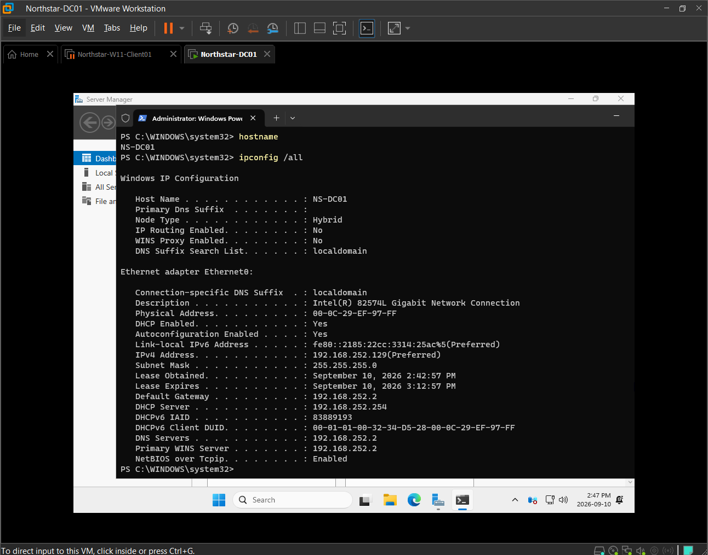
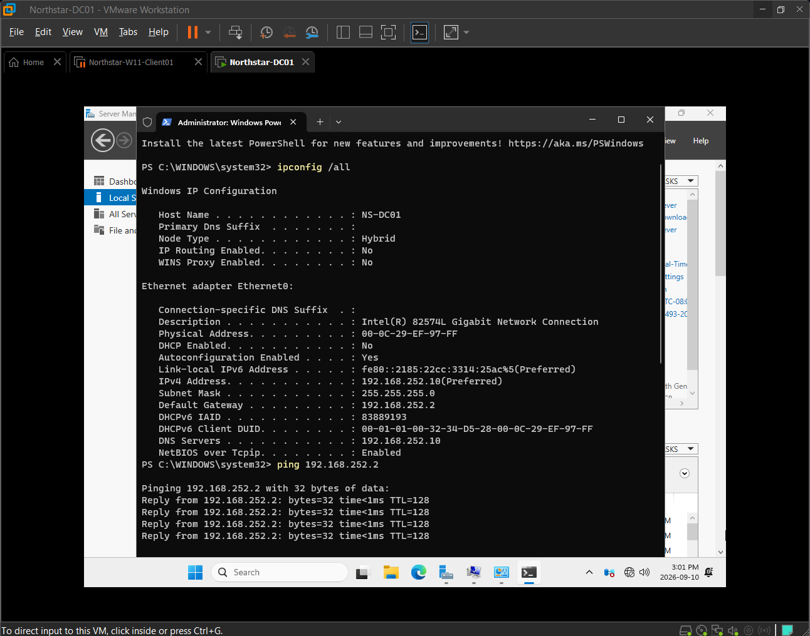
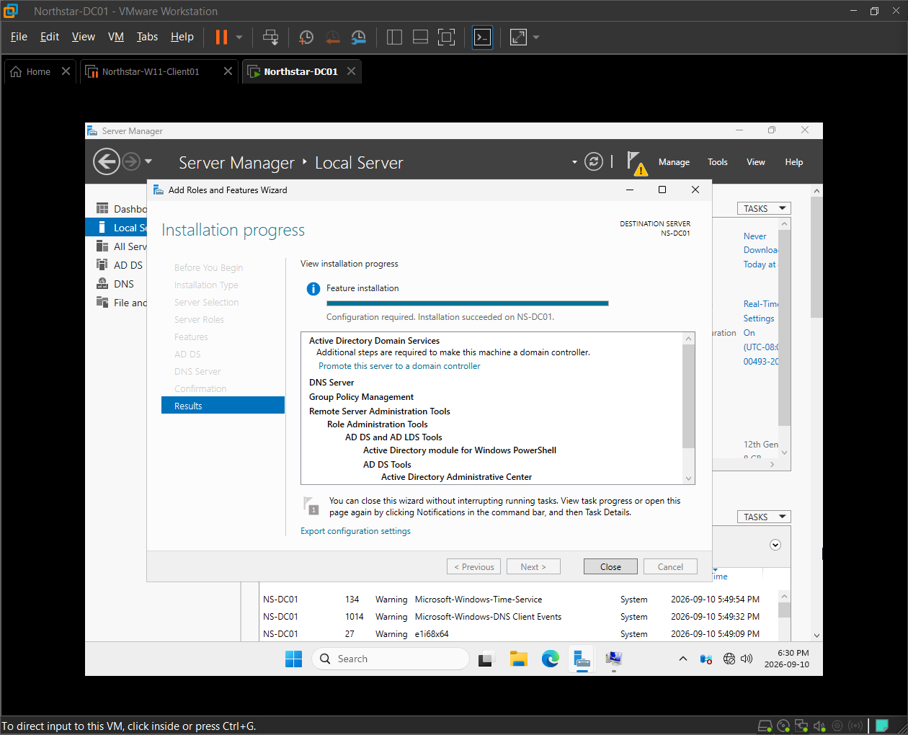
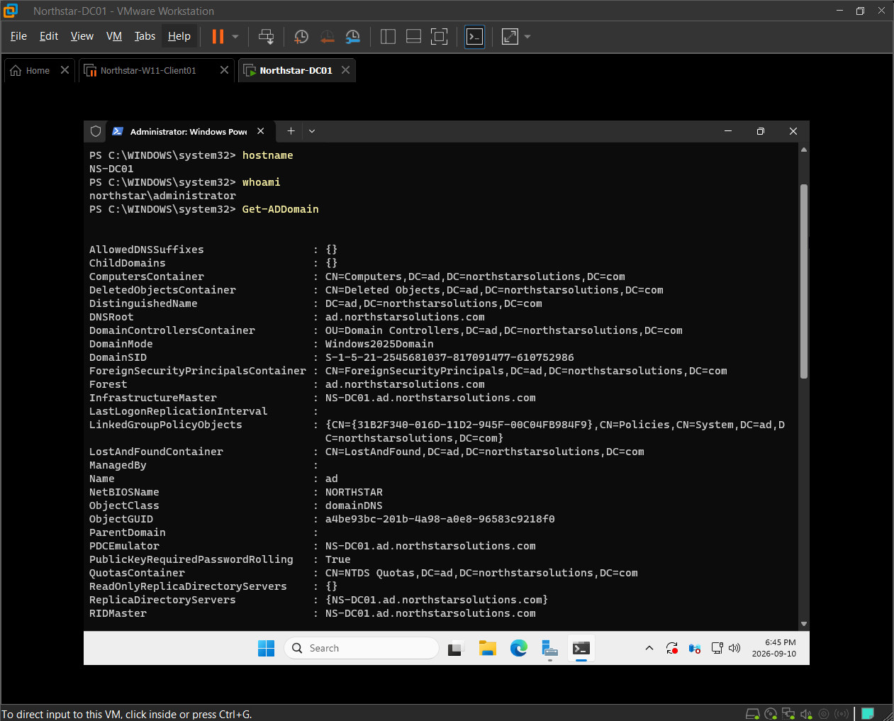
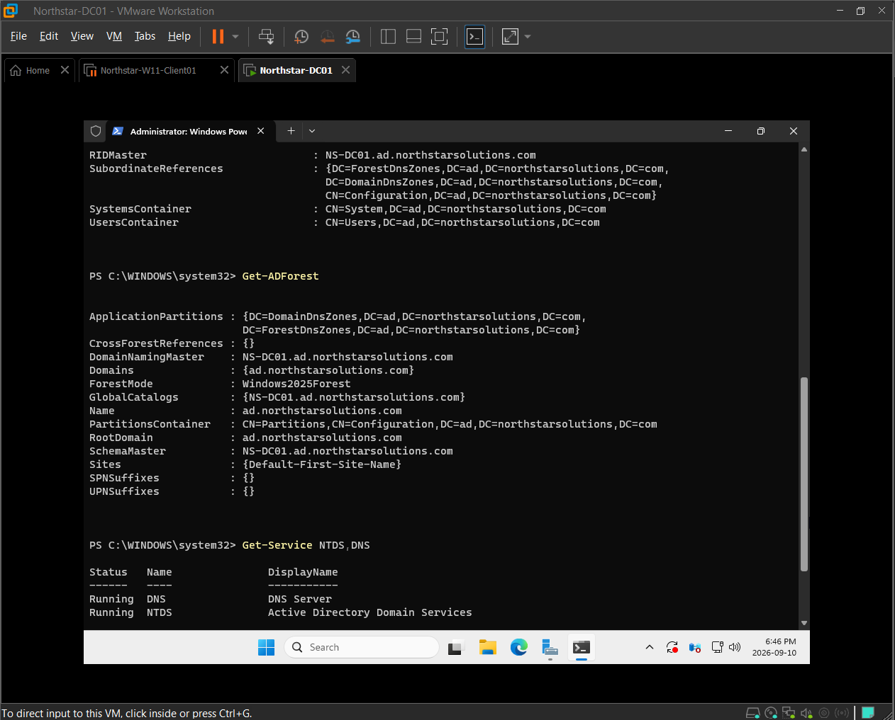
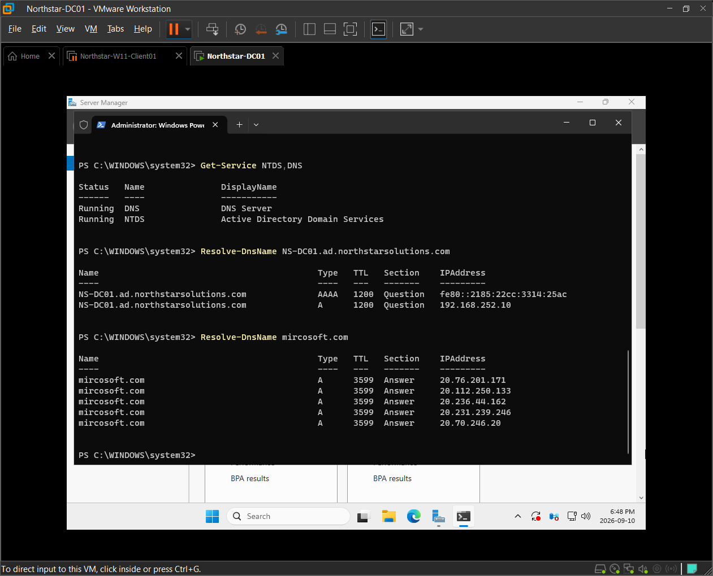

# Windows Server Infrastructure — Screenshot Evidence

## Purpose

This directory contains selected visual evidence collected while deploying, configuring, and validating `NS-DC01`, the Windows Server 2025 infrastructure server used in the Northstar Solutions enterprise IT homelab.

The evidence demonstrates server deployment, infrastructure addressing, Active Directory Domain Services and DNS installation, Domain Controller promotion, Active Directory validation, and DNS resolution testing.

Screenshots are grouped by administrative activity rather than documented individually when several images support the same task.

---

## 1. Windows Server Identity and System Baseline

### Context

A Windows Server 2025 virtual machine was deployed to provide centralized infrastructure services for the Northstar Solutions environment.

Before Active Directory Domain Services and DNS were introduced, the server identity, operating system, virtual hardware, and initial network configuration were reviewed and documented.

### Evidence



The server was standardized using the hostname:

`NS-DC01`

Naming convention:

- `NS` — Northstar Solutions
- `DC` — Domain Controller
- `01` — first server assigned to the role

The virtual machine was configured with:

- Windows Server 2025 Standard Evaluation
- 2 vCPU
- 4 GB RAM
- Approximately 60 GB virtual storage
- VMware Workstation
- VMware VMnet8 / NAT networking

### Outcome

The Windows Server system was deployed, standardized, and documented before infrastructure roles were introduced.

---

## 2. Static Infrastructure Addressing

### Context

`NS-DC01` initially received its network configuration dynamically through VMware DHCP.

Because the server was being prepared to provide core infrastructure services such as Active Directory and DNS, predictable addressing was configured before role deployment.

### Initial Network State

The server initially received:

- IPv4 address: `192.168.252.129`
- Subnet mask: `255.255.255.0`
- Default gateway: `192.168.252.2`
- DHCP server: `192.168.252.254`
- DNS server: `192.168.252.2`

The VMware network was identified as:

`192.168.252.0/24`

with the observed VMware DHCP allocation range:

`192.168.252.128-192.168.252.254`

### Configuration



The server was reconfigured with:

| Setting | Value |
|---|---|
| IPv4 Address | `192.168.252.10` |
| Subnet Mask | `255.255.255.0` |
| Prefix Length | `/24` |
| Default Gateway | `192.168.252.2` |
| Preferred DNS | `192.168.252.10` |
| Alternate DNS | None |
| DHCP | Disabled |

### Decision

A predictable IPv4 address was selected because systems providing core infrastructure services should be consistently reachable.

The address `192.168.252.10` is outside the VMware DHCP allocation range used by the lab.

`NS-DC01` was also configured to use its own address as its preferred DNS server in preparation for hosting DNS for the Active Directory environment.

### Validation

Connectivity was tested before Active Directory and DNS deployment using:

```cmd
ping 192.168.252.2
ping 8.8.8.8
```

The server successfully reached the VMware gateway and an external IP address.

A DNS query was also tested before DNS Server deployment:

```cmd
nslookup microsoft.com
```

At that stage, the query received no response because `NS-DC01` was already configured to query `192.168.252.10`, but no DNS Server role was running yet.

### Outcome

`NS-DC01` was configured with predictable infrastructure addressing and validated for IP connectivity before Active Directory deployment.

---

## 3. Active Directory Domain Services and DNS Installation

### Context

Northstar Solutions required centralized identity, authentication, DNS, and future policy management.

The Active Directory Domain Services and DNS Server roles were installed on `NS-DC01`.

### Evidence



Server Manager confirmed installation of:

- Active Directory Domain Services
- DNS Server
- Supporting Active Directory administration tools

After the roles were installed, the server still required promotion before it could operate as a Domain Controller.

### Domain Design

A new Active Directory forest was created using:

```text
ad.northstarsolutions.com
```

The NetBIOS domain name was configured as:

```text
NORTHSTAR
```

`NS-DC01` was promoted as the first Domain Controller in the new forest.

The promotion configuration included:

- Windows Server 2025 forest functional level
- Windows Server 2025 domain functional level
- DNS Server enabled
- Global Catalog enabled
- Read-Only Domain Controller disabled

A Directory Services Restore Mode password was configured during promotion but is intentionally not included in public project documentation.

### Outcome

The first Active Directory forest, domain, Domain Controller, and DNS Server for the Northstar Solutions environment were successfully deployed.

---

## 4. Active Directory Domain Validation

### Context

After Domain Controller promotion and restart, the Active Directory environment was validated rather than assuming that successful completion of the promotion wizard meant the infrastructure was fully operational.

### Evidence



Validation commands included:

```powershell
hostname
whoami
Get-ADDomain
```

The results confirmed:

- Hostname: `NS-DC01`
- Administrative context: `NORTHSTAR\Administrator`
- DNS domain: `ad.northstarsolutions.com`
- Distinguished name: `DC=ad,DC=northstarsolutions,DC=com`
- NetBIOS domain: `NORTHSTAR`
- Domain functional level: Windows Server 2025
- Domain Controller: `NS-DC01.ad.northstarsolutions.com`

The domain output also identified `NS-DC01` as the current holder of domain-level FSMO roles returned by `Get-ADDomain`, including:

- PDC Emulator
- RID Master
- Infrastructure Master

### Outcome

`NS-DC01` was successfully operating as a Domain Controller in the Northstar Solutions Active Directory domain.

---

## 5. Active Directory Forest and Service Validation

### Context

Additional validation was performed to confirm the forest configuration, Global Catalog role, forest-level FSMO role holders, and status of the core Active Directory and DNS services.

### Evidence



PowerShell validation included:

```powershell
Get-ADForest
Get-Service NTDS,DNS
```

The forest results confirmed:

- Forest root: `ad.northstarsolutions.com`
- Forest functional level: Windows Server 2025
- Root domain: `ad.northstarsolutions.com`
- Global Catalog: `NS-DC01.ad.northstarsolutions.com`
- Domain Naming Master: `NS-DC01.ad.northstarsolutions.com`
- Schema Master: `NS-DC01.ad.northstarsolutions.com`
- Active Directory site: `Default-First-Site-Name`

Service validation confirmed:

| Service | Function | Status |
|---|---|---|
| `NTDS` | Active Directory Domain Services | Running |
| `DNS` | DNS Server | Running |

### Interpretation

Because this is currently a single-Domain-Controller forest, `NS-DC01` holds the domain- and forest-level FSMO roles observed during validation.

The lab will examine FSMO administration in greater depth later in the Windows Server module.

### Outcome

The Active Directory forest, Global Catalog configuration, FSMO role placement, and core AD DS and DNS services were verified as operational.

---

## 6. DNS Resolution Validation

### Context

Before the DNS Server role was installed, `NS-DC01` had IP connectivity but could not obtain a DNS response from its own address because the DNS service did not yet exist.

After Active Directory and DNS deployment, name resolution was tested again.

### Evidence



PowerShell testing included:

```powershell
Resolve-DnsName NS-DC01.ad.northstarsolutions.com
Resolve-DnsName microsoft.com
```

### Internal DNS Validation

The internal Domain Controller FQDN:

```text
NS-DC01.ad.northstarsolutions.com
```

successfully resolved to:

```text
192.168.252.10
```

This confirmed name resolution for the internal Active Directory namespace.

### External DNS Validation

The external name:

```text
microsoft.com
```

also resolved successfully and returned public IP addresses.

### Interpretation

The results demonstrated two separate DNS capabilities:

- Resolution of the internal Active Directory namespace
- Resolution of external DNS names

This provided a useful comparison with the pre-deployment state, where external IP connectivity was available but DNS queries to `192.168.252.10` received no response because the DNS Server role had not yet been installed.

### Outcome

Internal and external DNS resolution were successfully validated after DNS Server deployment.

---

## Evidence Summary

The selected screenshots currently demonstrate practical administration of `NS-DC01` across the following areas:

- Windows Server deployment and identity standardization
- Windows Server virtual hardware baseline
- VMware network assessment
- Static IPv4 infrastructure addressing
- Pre-deployment network validation
- Active Directory Domain Services installation
- DNS Server installation
- New Active Directory forest creation
- Active Directory domain creation
- Domain Controller promotion
- Global Catalog configuration
- Active Directory domain validation
- Active Directory forest validation
- FSMO role observation
- Active Directory Domain Services verification
- DNS Server service verification
- Internal DNS resolution
- External DNS resolution

The evidence is intentionally selective.

Not every wizard page, command, or administrative action requires its own screenshot.

Detailed technical configuration is maintained in `server-baseline.md`, reusable concepts and procedures are maintained in the Windows Server Knowledge Base, and actual troubleshooting incidents will be documented separately if they occur.

Additional screenshots should only be added when they demonstrate a new administrative capability, important configuration change, meaningful validation result, or genuine troubleshooting activity.

## Status

**Windows Server Infrastructure Screenshot Evidence — In Progress**

Current evidence covers:

- Server deployment
- Static networking
- AD DS installation
- DNS installation
- Domain Controller promotion
- Active Directory validation
- DNS validation

Additional evidence will be added as the Northstar Solutions environment expands into:

- DNS record administration
- Organizational Units
- Domain users
- Security groups
- Windows 11 domain integration
- Centralized Group Policy
- DHCP
- File services
- PowerShell administration
- Security configuration
- Infrastructure troubleshooting