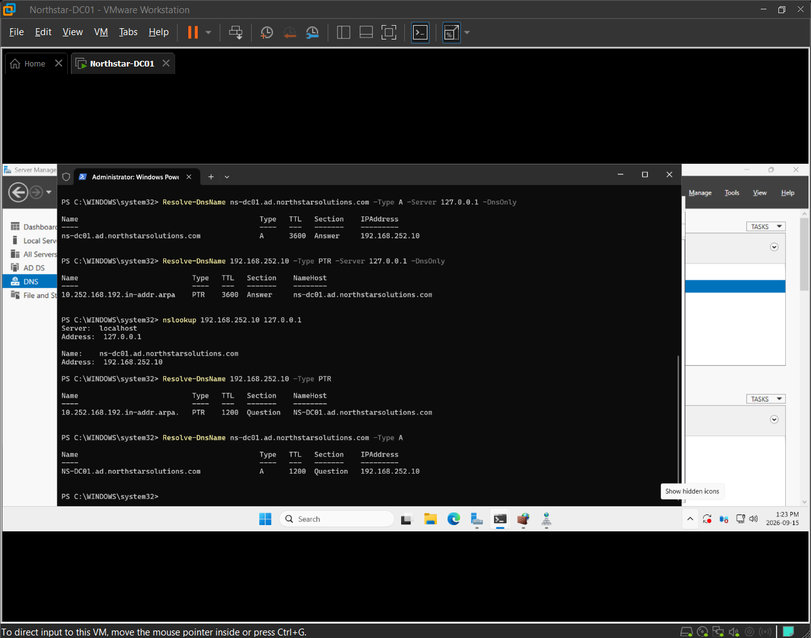
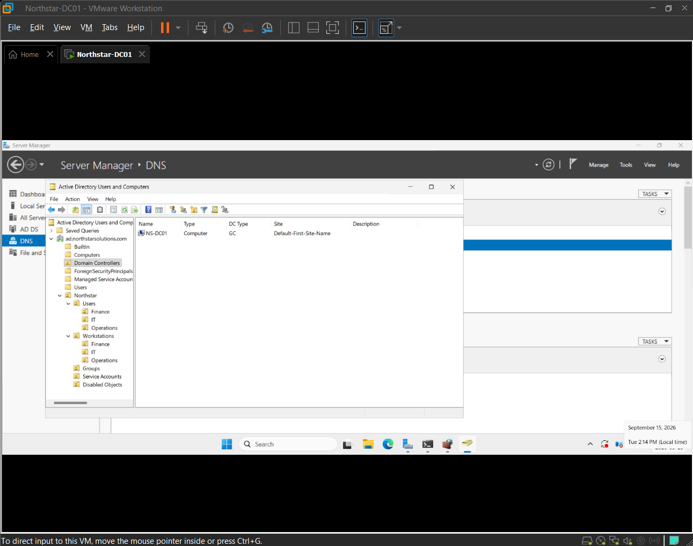
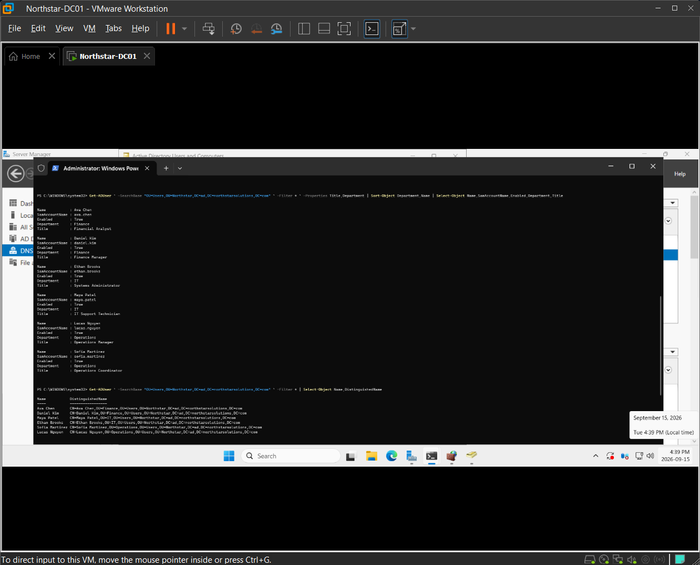
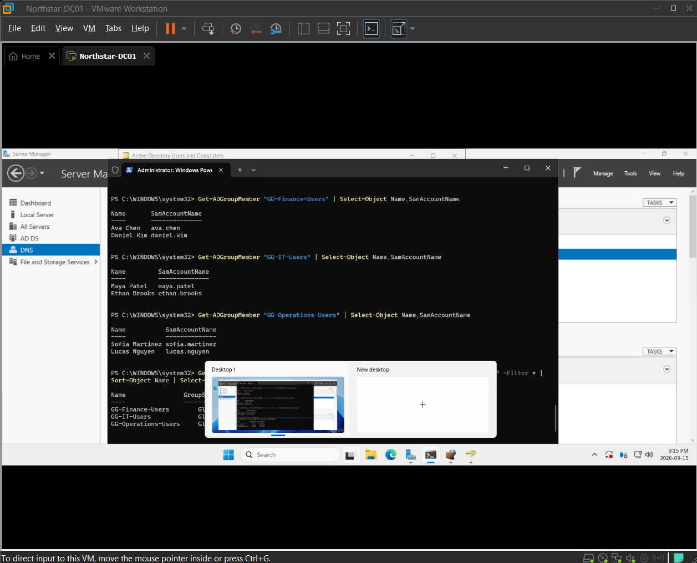
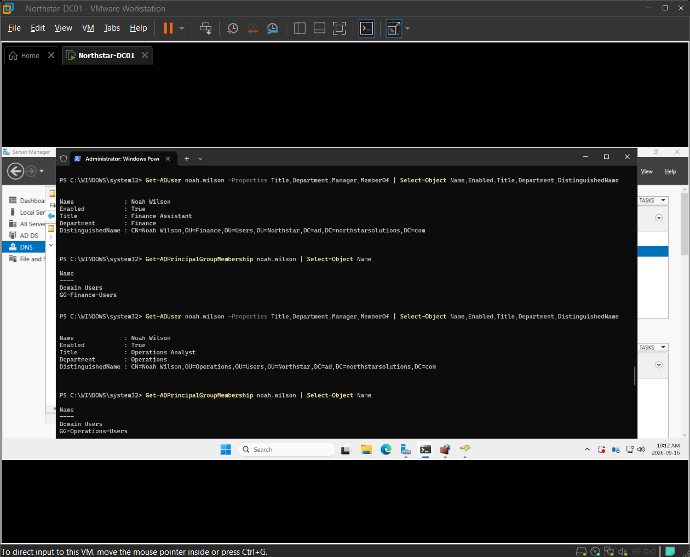
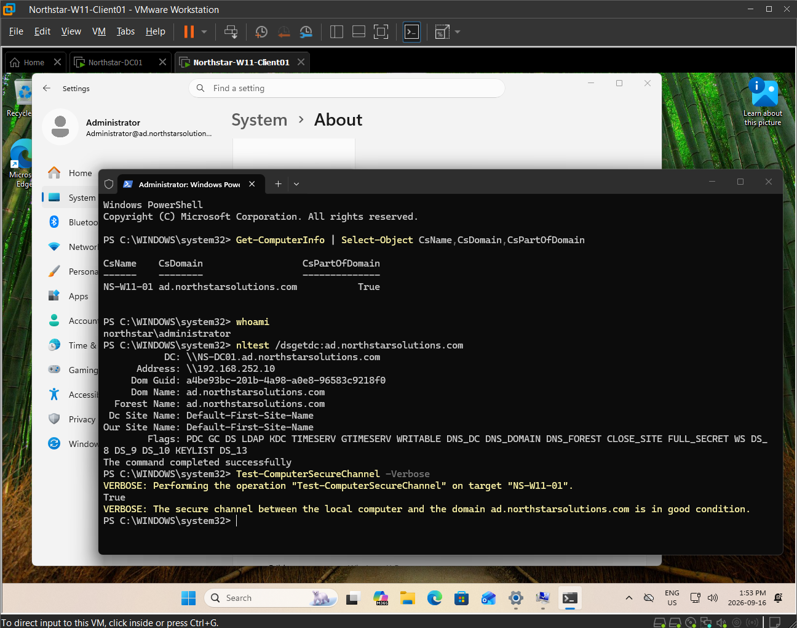
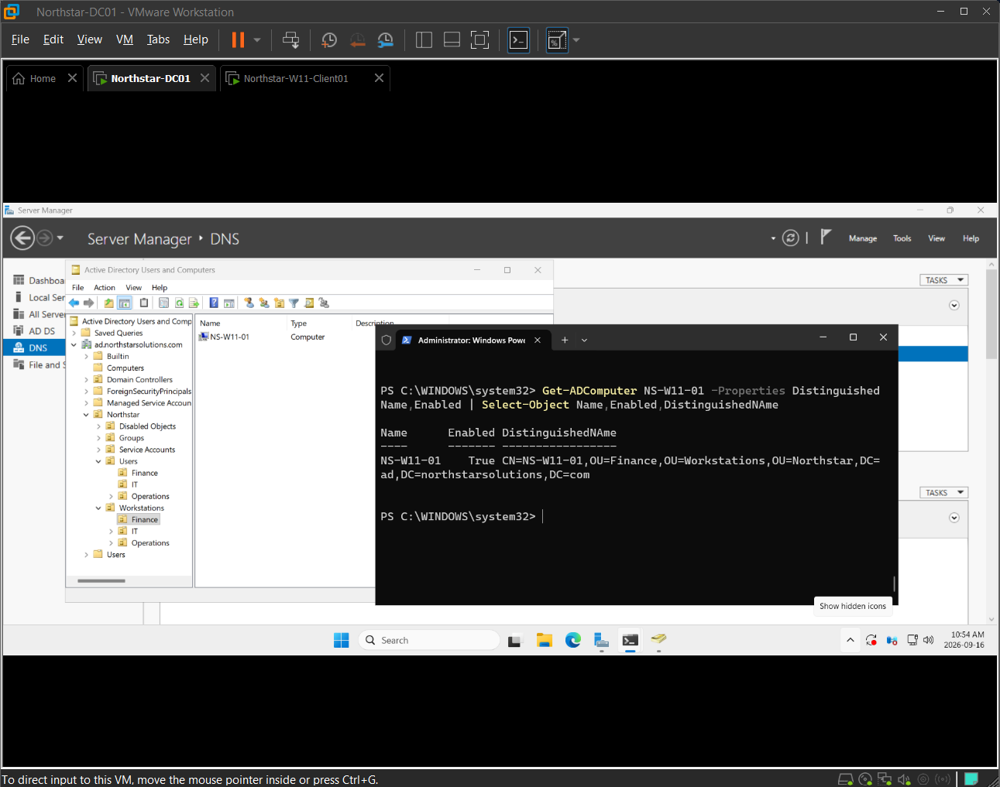
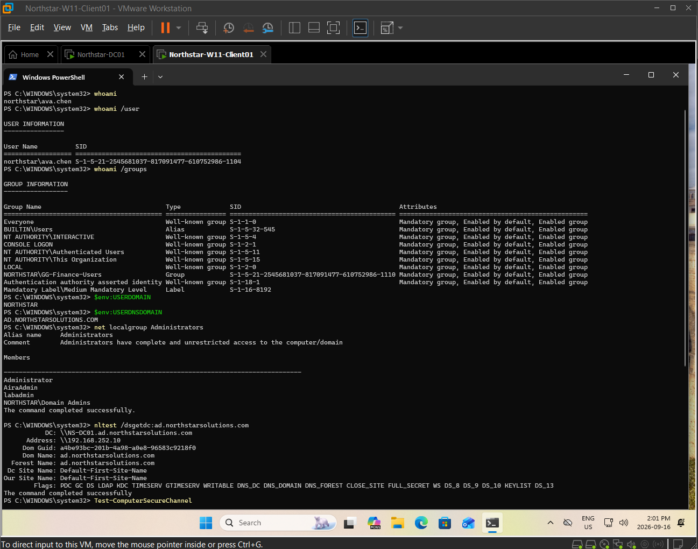

# Windows Server Infrastructure — Screenshot Evidence

## Purpose

This directory contains selected visual evidence collected while deploying, configuring, and administering `NS-DC01` and integrating the Finance workstation `NS-W11-01` into the Northstar Solutions domain.

The evidence demonstrates server deployment, Active Directory and DNS validation, directory-object administration, a fictional identity lifecycle, and workstation domain integration through September 16, 2026.

Screenshots are grouped by administrative activity rather than documented individually when several images support the same task.

---

## 1. Windows Server Identity and System Baseline

### Context

A Windows Server 2025 virtual machine was deployed to provide centralized infrastructure services for the Northstar Solutions environment.

Before Active Directory Domain Services and DNS were introduced, the server identity, operating system, virtual hardware, and initial network configuration were reviewed and documented.

### Evidence


The server was standardized using the hostname:

`NS-DC01`

Naming convention:

- `NS` — Northstar Solutions
- `DC` — Domain Controller
- `01` — first server assigned to the role

The virtual machine was configured with:

- Windows Server 2025 Standard Evaluation
- 2 vCPU
- 4 GB RAM
- Approximately 60 GB virtual storage
- VMware Workstation
- VMware VMnet8 / NAT networking

### Outcome

The Windows Server system was deployed, standardized, and documented before infrastructure roles were introduced.

---

## 2. Static Infrastructure Addressing

### Context

`NS-DC01` initially received its network configuration dynamically through VMware DHCP.

Because the server was being prepared to provide core infrastructure services such as Active Directory and DNS, predictable addressing was configured before role deployment.

### Initial Network State

The server initially received:

- IPv4 address: `192.168.252.129`
- Subnet mask: `255.255.255.0`
- Default gateway: `192.168.252.2`
- DHCP server: `192.168.252.254`
- DNS server: `192.168.252.2`

The VMware network was identified as:

`192.168.252.0/24`

with the observed VMware DHCP allocation range:

`192.168.252.128-192.168.252.254`

### Configuration


The server was reconfigured with:

| Setting | Value |
|---|---|
| IPv4 Address | `192.168.252.10` |
| Subnet Mask | `255.255.255.0` |
| Prefix Length | `/24` |
| Default Gateway | `192.168.252.2` |
| Preferred DNS | `192.168.252.10` |
| Alternate DNS | None |
| DHCP | Disabled |

### Decision

A predictable IPv4 address was selected because systems providing core infrastructure services should be consistently reachable.

The address `192.168.252.10` is outside the VMware DHCP allocation range used by the lab.

`NS-DC01` was also configured to use its own address as its preferred DNS server in preparation for hosting DNS for the Active Directory environment.

After Domain Controller promotion, the server's current IPv4 DNS client configuration was later verified as `127.0.0.1`, which points to the DNS service running locally on `NS-DC01`. This later state is recorded in `server-baseline.md`; an additional screenshot was not retained because the existing evidence already demonstrates the server's DNS deployment and successful resolution.

### Validation

Connectivity was tested before Active Directory and DNS deployment using:

```cmd
ping 192.168.252.2
ping 8.8.8.8
```

The server successfully reached the VMware gateway and an external IP address.

A DNS query was also tested before DNS Server deployment:

```cmd
nslookup microsoft.com
```

At that stage, the query received no response because `NS-DC01` was already configured to query `192.168.252.10`, but no DNS Server role was running yet.

### Outcome

`NS-DC01` was configured with predictable infrastructure addressing and validated for IP connectivity before Active Directory deployment.

---

## 3. Active Directory Domain Services and DNS Installation

### Context

Northstar Solutions required centralized identity, authentication, DNS, and future policy management.

The Active Directory Domain Services and DNS Server roles were installed on `NS-DC01`.

### Evidence


Server Manager confirmed installation of:

- Active Directory Domain Services
- DNS Server
- Supporting Active Directory administration tools

After the roles were installed, the server still required promotion before it could operate as a Domain Controller.

### Domain Design

A new Active Directory forest was created using:

```text
ad.northstarsolutions.com
```

The NetBIOS domain name was configured as:

```text
NORTHSTAR
```

`NS-DC01` was promoted as the first Domain Controller in the new forest.

The promotion configuration included:

- Windows Server 2025 forest functional level
- Windows Server 2025 domain functional level
- DNS Server enabled
- Global Catalog enabled
- Read-Only Domain Controller disabled

A Directory Services Restore Mode password was configured during promotion but is intentionally not included in public project documentation.

### Outcome

The first Active Directory forest, domain, Domain Controller, and DNS Server for the Northstar Solutions environment were successfully deployed.

---

## 4. Active Directory Domain Validation

### Context

After Domain Controller promotion and restart, the Active Directory environment was validated rather than assuming that successful completion of the promotion wizard meant the infrastructure was fully operational.

### Evidence


Validation commands included:

```powershell
hostname
whoami
Get-ADDomain
```

The results confirmed:

- Hostname: `NS-DC01`
- Administrative context: `NORTHSTAR\Administrator`
- DNS domain: `ad.northstarsolutions.com`
- Distinguished name: `DC=ad,DC=northstarsolutions,DC=com`
- NetBIOS domain: `NORTHSTAR`
- Domain functional level: Windows Server 2025
- Domain Controller: `NS-DC01.ad.northstarsolutions.com`

The domain output also identified `NS-DC01` as the current holder of domain-level FSMO roles returned by `Get-ADDomain`, including:

- PDC Emulator
- RID Master
- Infrastructure Master

### Outcome

`NS-DC01` was successfully operating as a Domain Controller in the Northstar Solutions Active Directory domain.

---

## 5. Active Directory Forest and Service Validation

### Context

Additional validation was performed to confirm the forest configuration, Global Catalog role, forest-level FSMO role holders, and status of the core Active Directory and DNS services.

### Evidence


PowerShell validation included:

```powershell
Get-ADForest
Get-Service NTDS,DNS
```

The forest results confirmed:

- Forest root: `ad.northstarsolutions.com`
- Forest functional level: Windows Server 2025
- Root domain: `ad.northstarsolutions.com`
- Global Catalog: `NS-DC01.ad.northstarsolutions.com`
- Domain Naming Master: `NS-DC01.ad.northstarsolutions.com`
- Schema Master: `NS-DC01.ad.northstarsolutions.com`
- Active Directory site: `Default-First-Site-Name`

Service validation confirmed:

| Service | Function | Status |
|---|---|---|
| `NTDS` | Active Directory Domain Services | Running |
| `DNS` | DNS Server | Running |

### Interpretation

Because this is currently a single-Domain-Controller forest, `NS-DC01` holds the domain- and forest-level FSMO roles observed during validation.

The lab will examine FSMO administration in greater depth later in the Windows Server module.

### Outcome

The Active Directory forest, Global Catalog configuration, FSMO role placement, and core AD DS and DNS services were verified as operational.

---

## 6. DNS Resolution Validation

### Context

Before the DNS Server role was installed, `NS-DC01` had IP connectivity but could not obtain a DNS response from its own address because the DNS service did not yet exist.

After Active Directory and DNS deployment, name resolution was tested again.

### Evidence


PowerShell testing included:

```powershell
Resolve-DnsName NS-DC01.ad.northstarsolutions.com
Resolve-DnsName microsoft.com
```

### Internal DNS Validation

The internal Domain Controller FQDN:

```text
NS-DC01.ad.northstarsolutions.com
```

successfully resolved to:

```text
192.168.252.10
```

This confirmed name resolution for the internal Active Directory namespace.

### External DNS Validation

The external name:

```text
microsoft.com
```

also resolved successfully and returned public IP addresses.

### Interpretation

The results demonstrated two separate DNS capabilities:

- Resolution of the internal Active Directory namespace
- Resolution of external DNS names

This provided a useful comparison with the pre-deployment state, where external IP connectivity was available but DNS queries to `192.168.252.10` received no response because the DNS Server role had not yet been installed.

### Outcome

Internal and external DNS resolution were successfully validated after DNS Server deployment.

---

## 7. Forward and Reverse DNS Administration

### Context

After the original DNS deployment, reverse DNS administration was added for `192.168.252.0/24`. The lab notes record an Active Directory-integrated reverse zone, `252.168.192.in-addr.arpa`, with secure dynamic updates and a PTR record for `NS-DC01`.

### Evidence



The screenshot shows queries executed on `NS-DC01` against its local DNS service:

```powershell
Resolve-DnsName ns-dc01.ad.northstarsolutions.com -Type A -Server 127.0.0.1 -DnsOnly
Resolve-DnsName 192.168.252.10 -Type PTR -Server 127.0.0.1 -DnsOnly
```

| Query | Returned Value | Displayed Section |
|---|---|---|
| A — `ns-dc01.ad.northstarsolutions.com` | `192.168.252.10` | Answer |
| PTR — `10.252.168.192.in-addr.arpa` | `ns-dc01.ad.northstarsolutions.com` | Answer |

An explicit `nslookup 192.168.252.10 127.0.0.1` query also returns the DC hostname.

### Interpretation

The ordinary queries shown below the explicit tests display `Section = Question`. This difference is retained as a validation observation; the screenshot alone does not establish how those ordinary queries obtained their results.

The explicit queries demonstrate the expected A and PTR results. The Answer section alone is not treated as proof of the DNS authoritative-answer flag. Zone integration, secure-update settings, and temporary A/CNAME cleanup are recorded in the lab notes rather than displayed by this image.

### Outcome

Forward and reverse resolution for `NS-DC01` were validated with DNS-only queries explicitly targeting the local DNS service.

---

## 8. Active Directory Organizational Unit Structure

### Context

A custom OU hierarchy was created to support user and workstation administration, future Group Policy targeting, and identity lifecycle management.

### Evidence



The visible hierarchy includes:

```text
Northstar
├── Users
│   ├── Finance
│   ├── IT
│   └── Operations
├── Workstations
│   ├── Finance
│   ├── IT
│   └── Operations
├── Groups
├── Service Accounts
└── Disabled Objects
```

The default `Domain Controllers` OU is selected and contains `NS-DC01`. The notes record accidental-deletion protection for the custom OUs, but that setting is not visible in this hierarchy view.

### Outcome

The directory has an administrative structure for the later user, workstation, identity lifecycle, and policy tasks. The Domain Controller remains in its default OU.

---

## 9. Domain User Administration

### Context

Six fictional employees were created across Finance, IT, and Operations. Directory attributes and departmental OU placement were checked with PowerShell.

### Evidence



The displayed results show:

| Employee | Account | Department | Title |
|---|---|---|---|
| Ava Chen | `ava.chen` | Finance | Financial Analyst |
| Daniel Kim | `daniel.kim` | Finance | Finance Manager |
| Maya Patel | `maya.patel` | IT | IT Support Technician |
| Ethan Brooks | `ethan.brooks` | IT | Systems Administrator |
| Sofia Martinez | `sofia.martinez` | Operations | Operations Coordinator |
| Lucas Nguyen | `lucas.nguyen` | Operations | Operations Manager |

Each account is shown as enabled. A second query displays Distinguished Names identifying the departmental Users OUs beneath `Northstar`.

Manager relationships and initial password-change settings are recorded in the lab notes; they are not displayed in this screenshot. Temporary passwords are excluded from documentation.

### Outcome

The six enabled employee accounts, departmental attributes, and OU placement were verified for later authentication, access-control, and policy exercises.

---

## 10. Active Directory Security Groups

### Context

Departmental Global Security groups were created to organize account membership before resource-specific permissions are introduced.

### Evidence



The `Get-ADGroupMember` results clearly show:

| Group | Members |
|---|---|
| `GG-Finance-Users` | Ava Chen, Daniel Kim |
| `GG-IT-Users` | Maya Patel, Ethan Brooks |
| `GG-Operations-Users` | Sofia Martinez, Lucas Nguyen |

A desktop overlay partially obscures the group scope/category output at the bottom. The Global/Security configuration is recorded in the lab notes; the retained image primarily supports the membership verification.

### Validation Finding

The notes record incorrect initial group assignments discovered during verification. The assignments were corrected and re-verified. This image shows the corrected memberships, not the earlier incorrect state.

The finding is documented as a configuration-validation correction rather than an intentionally induced support incident.

### Outcome

Departmental memberships were verified. This establishes the Accounts → Global Groups portion of AGDLP; Domain Local groups and resource permissions remain future work.

---

## 11. Identity Lifecycle Administration

### Context

The fictional account `noah.wilson` was used to practice onboarding, an internal transfer, and offboarding. Both images retain their existing filenames and belong to this single activity.

### Onboarding and Transfer Evidence



The first image shows the account enabled in both stages:

| Stage | Title / Department | Users OU | Displayed Memberships |
|---|---|---|---|
| Onboarding | Finance Assistant / Finance | Finance | `Domain Users`, `GG-Finance-Users` |
| Transfer | Operations Analyst / Operations | Operations | `Domain Users`, `GG-Operations-Users` |

The results demonstrate separate updates to attributes, OU placement, and group membership. Manager changes are recorded in the notes but are not displayed in the selected output.

### Offboarding Evidence


The final results show:

- `Enabled = False`.
- Operations title and department retained.
- Distinguished Name under `OU=Disabled Objects,OU=Northstar`.
- Only `Domain Users` in the displayed group-membership results.

### Outcome

The fictional account was onboarded, transferred, and retained as a disabled directory object after departmental memberships were removed. This is a controlled administration exercise, not a real employee offboarding or an unexpected outage.

---

## 12. Windows 11 Domain Membership and Secure Channel

### Context

The lab notes record configuration of `NS-W11-01` to use internal DNS at `192.168.252.10` while retaining VMware DHCP addressing. The workstation was then joined to the Northstar domain.

### Evidence



The administrative validation session shows:

```powershell
Get-ComputerInfo | Select-Object CsName,CsDomain,CsPartOfDomain
nltest /dsgetdc:ad.northstarsolutions.com
Test-ComputerSecureChannel -Verbose
```

| Check | Observed Result |
|---|---|
| Computer | `NS-W11-01` |
| Domain | `ad.northstarsolutions.com` |
| Part of Domain | `True` |
| Discovered DC | `NS-DC01.ad.northstarsolutions.com` |
| DC Address | `192.168.252.10` |
| Secure Channel | `True`; reported in good condition |

This image shows post-join results. The pre-join DNS observations and DNS-client setting change are recorded in the notes rather than shown here.

### Outcome

Domain membership, DC discovery, and the workstation-domain secure channel were verified beyond the domain-join wizard.

---

## 13. Active Directory Computer Object

### Context

After the domain join, the workstation computer account was placed in the Finance Workstations OU to support future policy targeting.

### Evidence



The server-side query shows the account enabled at:

```text
CN=NS-W11-01,OU=Finance,OU=Workstations,OU=Northstar,DC=ad,DC=northstarsolutions,DC=com
```

The Active Directory Users and Computers view also shows `NS-W11-01` under the selected Finance Workstations OU.

### Outcome

The enabled computer object is in the intended administrative location. This demonstrates placement, not deployment or application of a new Group Policy.

---

## 14. Standard Domain User Authentication

### Context

A Finance user session was checked on the domain-joined workstation to validate the authenticated identity, departmental membership, and standard-user context.

### Evidence



The screenshot shows:

- `whoami` identifying `NORTHSTAR\ava.chen`.
- The user's SID from `whoami /user`.
- `NORTHSTAR\GG-Finance-Users` in `whoami /groups` output.
- `USERDOMAIN=NORTHSTAR` and `USERDNSDOMAIN=AD.NORTHSTARSOLUTIONS.COM`.
- Local Administrators membership with no individual Ava Chen entry.
- No `BUILTIN\Administrators` entry in the displayed user token.
- Successful Domain Controller discovery using `nltest`.

### Interpretation

The token and local group output support the documented standard-user session and departmental membership. They do not constitute a complete audit of resource permissions.

`Test-ComputerSecureChannel` appears at the bottom without a visible result. The successful secure-channel result is documented in section 12 from the separate administrative session; this image is not used to claim that the command succeeded in Ava's session.

### Outcome

The workstation authenticated the Finance domain identity and reflected the departmental group in the Windows session.

---

## Evidence Summary

The selected screenshots demonstrate server administration and workstation integration across the following areas:

- Windows Server deployment and identity standardization
- Windows Server virtual hardware baseline
- VMware network assessment
- Static IPv4 infrastructure addressing
- Pre-deployment network validation
- Active Directory Domain Services installation
- DNS Server installation
- New Active Directory forest creation
- Active Directory domain creation
- Domain Controller promotion
- Global Catalog configuration
- Active Directory domain validation
- Active Directory forest validation
- FSMO role observation
- Active Directory Domain Services verification
- DNS Server service verification
- Internal DNS resolution
- External DNS resolution
- DNS-only forward and reverse record validation
- Active Directory OU structure and Domain Controller placement
- Enabled employee identities, directory attributes, and OU placement
- Departmental group membership verification
- Fictional employee onboarding, transfer, and offboarding
- Workstation domain membership and Domain Controller discovery
- Workstation-domain secure-channel validation
- Enabled workstation computer object and Finance OU placement
- Domain-user identity, group-token membership, and standard-user session checks

The evidence is intentionally selective.

Not every wizard page, command, or administrative action requires its own screenshot.

Detailed technical configuration is maintained in `server-baseline.md`, reusable concepts and procedures are maintained in the Windows Server Knowledge Base, and troubleshooting evidence will be documented separately as genuine project incidents, simulated support incidents, or focused troubleshooting exercises.

See the [server baseline](../server-baseline.md), [server knowledge base](../../knowledge-base/windows-server-administration.md), and [module overview](../README.md) for supporting documentation. Written lab notes cover actions without dedicated images; each section above distinguishes those actions from visible evidence.

Additional screenshots should only be added when they demonstrate a new administrative capability, important configuration change, meaningful validation result, or genuine troubleshooting activity.

## Status

**Windows Server Infrastructure Screenshot Evidence — Complete through Phase 5**

Current evidence covers:

- Server deployment
- Static networking
- AD DS installation
- DNS installation
- Domain Controller promotion
- Active Directory validation
- DNS validation
- DNS record administration and reverse resolution
- Organizational Units, domain users, and departmental memberships
- Identity lifecycle administration
- Windows 11 domain integration and computer-object placement
- Domain-user authentication and workstation trust validation

The retained set contains 15 images across activities 01–14, including the two images for activity 11. Existing filenames and historical screenshots are preserved.

Phase 6 — Centralized Group Policy is the next technical phase and has not yet started hands-on. The next meaningful screenshot will use the `15-...` prefix.

Later evidence will be added selectively for DHCP, file services, PowerShell automation, server operations, security, monitoring, and troubleshooting. No intentionally induced Phase 4–5 fault scenario is reported complete.
